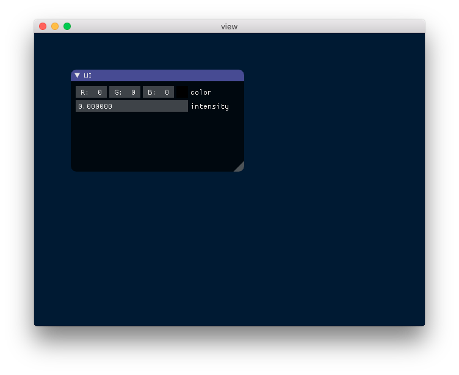
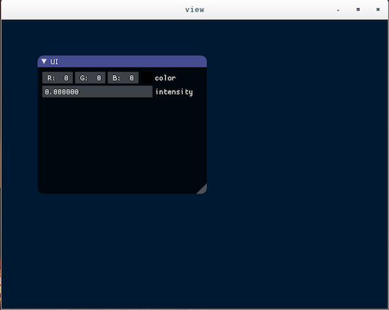
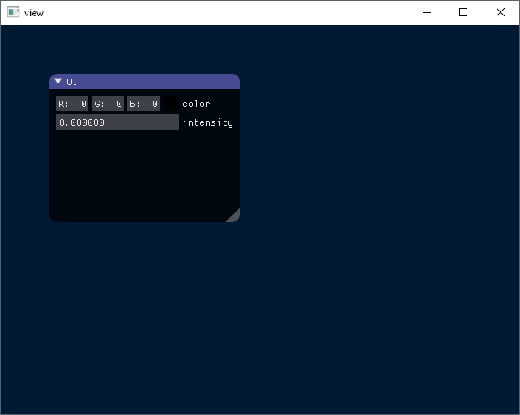

# Cross-platform C++ Window/UI bootstrap 

Simple cross-platform C++ windowing bootstrap with ImGui support.

Mac, Linux and Windows(Visual Studio 2013 and 2015) are supported.

## Requirements

* OpenGL 2.x
* premake5(optional. required to build example program)
* GTK+3(optional. required for nativefiledialog support)

## Build on Mac and Linux

    $ premake5 gmake
    $ make

### Optional build on linux

You can enable nativefiledialog support with `--with-gtk3nfd` premake options(GTK+3 required)

    $ premake5 --with-gtk3nfd gmake

## Build on Windows

    > premake5.exe vs2013

Or

    > premake5.exe vs2015

## How to use codes in your project.

Please simply copy following directories/files into your project.

* nativefiledialog/
* OpenGLWindow/
* ThirdPartyLibs/
* imgui/

## License

`window-bootstrap` is just a composed of existing OSS libraries. `example.cc` is public domain.

* ImGui : The MIT license. Copyright (c) 2014-2015 Omar Cornut and ImGui contributors.
* ImGuizmo : The MIT license. (`imgui/ImGuizmo.LICENSE`)
* bt3gui : zlib license. 
* nativefiledialog : The MIT license. (`nativefiledialog/LICENSE`)
* glew : BSD/MIT license.
